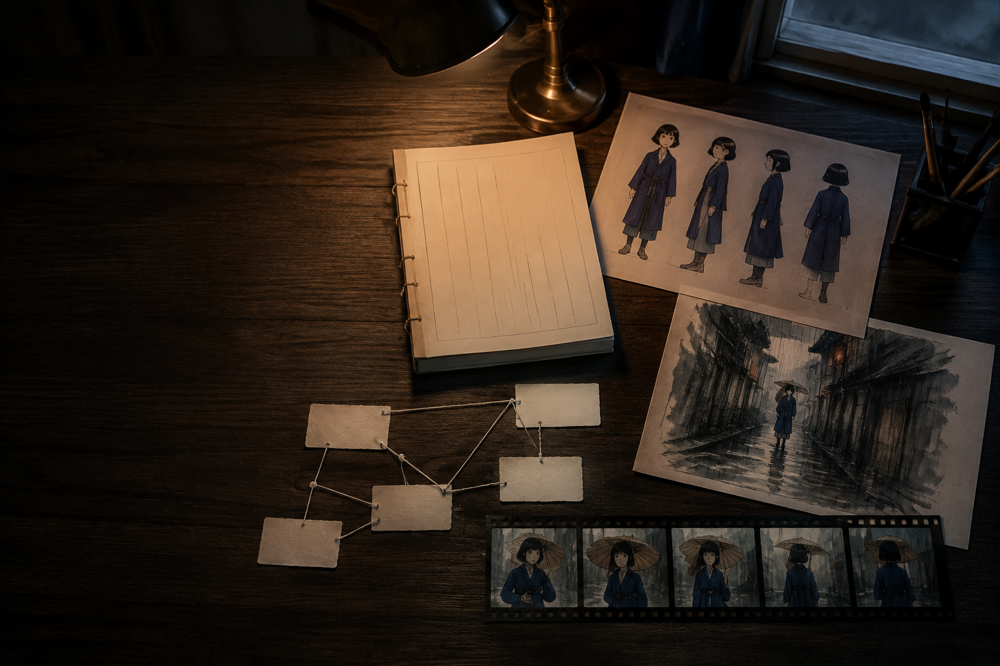
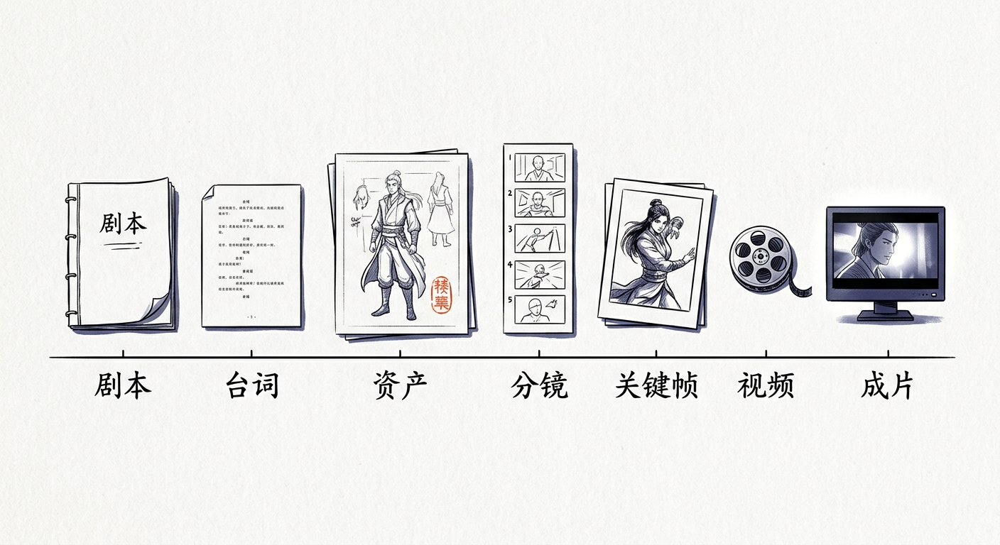

# Canvillage

**Infinite Canvas for Village Chiefs · 村长无限画布**

**修改版声明：Canvillage 是在上游代码基础上修改的独立分发版本，包含产品命名、本地运行、画布与影视工作流、Agent 能力和发布范围调整；原作者及第三方许可声明保留。**

源码仓库：[mengxiangshu666/Canvillage](https://github.com/mengxiangshu666/Canvillage)。

本机上的一条短剧生产线。剧本、角色、场景、分镜、画面和成片，都留在你自己的电脑里。



打开之后是一块可以无限铺开的画布。你在上面把一场戏拆开，再按顺序接回去。视频模型只负责让已经定好的画面动起来。角色像不像、场景有没有跑偏，靠前面的资产图，不靠临时碰运气。

## 一场戏怎么走



1. 先把故事写成能拍的剧本。没有起承转合，后面的图都是白做。
2. 台词单独过一遍。嘴里说的和心里想的要分开，一句台词得真的在做事。
3. 角色、场景、道具先画成能反复用的资产。角色要有能对上的多视图，场景要有能回去的空间。
4. 再拆分镜、定关键帧。一张首帧必须把这个人的头、颈、肩、胸口交代清楚。
5. 最后才进视频。模型、时长、参考图对不上，就停在这一步，不去硬出。
6. 满意的镜头收回主线，剪成一集。

画布上可以先试。试出来的角色图、场景图、镜头，确认之后写回这条主线。主线负责把一集做完，画布负责在做完之前把不对的地方找出来。

## 它留在你电脑上的东西

项目、画布、生成的图和视频、模型配置、任务记录，都在本目录的 `项目资产`。私人密钥也在这里，不进仓库。

Windows 上双击 `启动村长无限画布.vbs`，或运行 `启动村长无限画布.bat`。服务起来后打开：

```text
http://127.0.0.1:8784
```

已经在跑的话，再开一次只会打开网页，不会再起一份。要停，运行同目录的 `_stop.ps1`。它只停这个项目自己的进程。

模型不在本机跑。图片、视频、文字、声音都走你自己配好的网关。网关没配好，画布可以打开，生成会停住。这是预期，不是故障。

## 源码与运行包

源码在 `src/` 和 `frontend/src/`。源码包不包含便携 `runtime/`、已经构建的前端、开发依赖或私人项目，不能直接当成独立运行包双击启动。上面的 Windows 启动入口适用于已经安装好便携运行环境的目录。

源码开发需要 Python 3.11/3.12、uv，以及前端 `package.json` 指定的 pnpm。依赖版本以锁文件为准。在项目根目录使用 PowerShell：

```powershell
uv sync --group dev
Push-Location frontend
pnpm install --frozen-lockfile
pnpm run build:supercanvas
Pop-Location
$env:NOVELVIDEO_DATA_ROOT = Join-Path $PWD '项目资产'
.venv\Scripts\python.exe -m novelvideo.cli api --host 127.0.0.1 --port 8784
```

开发检查使用项目内 `.venv\Scripts\python.exe -m pytest`，前端使用 `pnpm test`。不要把模型 Key、真实项目、日志或构建缓存添加到 Git。更完整的发布边界见 [公开源码说明](docs/PUBLIC_SOURCE_RELEASE.md)。

模型支持范围以当前连接的上游目录及实际任务验证为准。源码包的准备不代表每个模型、全新机器安装或所有可选功能都已经验证。

## 许可

本项目当前采用 [Elastic License 2.0](LICENSES/Elastic-2.0.txt)，属于源码可得许可，含使用限制。公开源码不等于切换到 MIT 或 Apache 许可；上游及第三方版权、商标和其他必要声明保留。具体条款以许可证正文为准。

## Notices

See `NOTICE` for required branding and third-party attribution notices.
